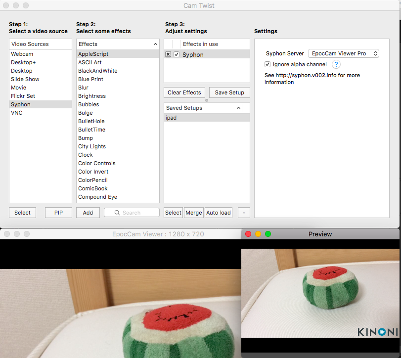
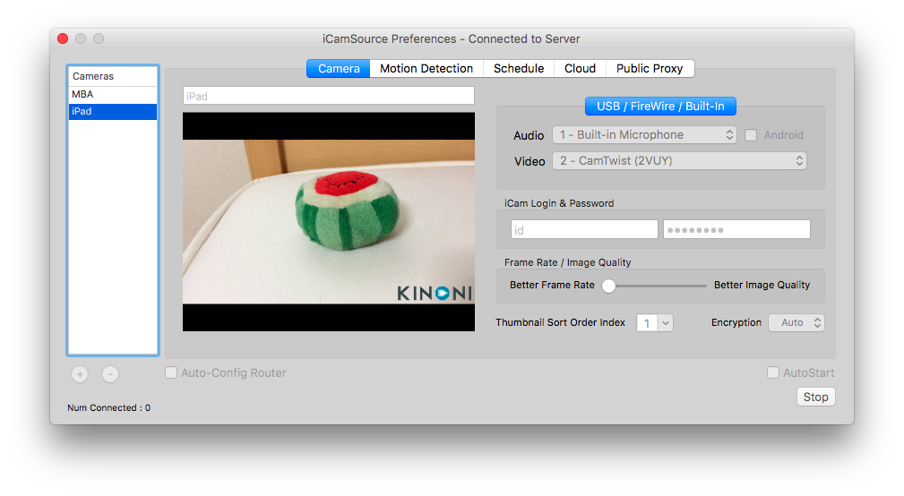

iCamを使って外出先から部屋にいる犬の様子を見たいが、MBAのカメラ1つじゃ視野が狭い。
ということで、部屋に置いているiPadのカメラの映像も同時に見れるようにした。

使わなくなった古いiPhoneを使ってもよい。

<!--more-->

## 必要なもの
- PC (今回はMBA)
  - EpocCam Viewer Pro
  - CamTwist
  - iCamSource
- iPad
  - EpocCam
- iPhone
  - iCam

## 構成

## iPadのウェブカメラ化
EpocCamというアプリを使って、iPadのカメラ画像をMBAで受信する。
これは特に設定もいらない簡単アプリ。同一LANである必要があるので、それだけ注意。

更に、それをCamTwistというアプリで受けることで、ウェブカメラの入力画像のように使えるようになる。

EpocCamが繋がっている状態 (上図左下) で、CamTwistの設定をSyphonにして、Syphon ServerとしてEpocCam Viewer Proを選択する (上図上) 。
CamTwistのPreviewにEpocCamと同じ映像が表示されれば成功 (上図右下) 。

## iCamの設定
MBAにiCamSourceというアプリを入れて、VideoにCamTwist (2VUY)を選択する。
idとパスワードは適当に入力して、右下のStartボタンを押して、EpocCamと同じ映像が表示されれば成功。

iPhoneに入れたiCamアプリにidとパスワードを入力するとiPadのカメラの映像を見ることができる。
